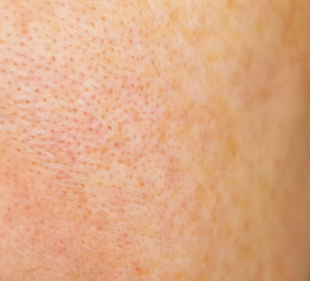

Skin Types Classification
======================

The Skin Type Classification project leverages advanced machine learning techniques to accurately classify skin types according to the renowned Baumann Skin Type Classification System. This system, developed by dermatologist Dr. Leslie Baumann, is widely recognized for its comprehensive approach to categorizing skin into distinct types based on various attributes such as sensitivity, moisture retention, pigmentation and wrinkles.

This project aims to provide an efficient tool for both skincare professionals and enthusiasts to determine their Baumann skin type quickly and accurately. By utilizing a diverse dataset of facial images, along with carefully curated feature extraction methods, this model can effectively differentiate between the various Baumann skin types, enabling personalized skincare recommendations and routines.

How to use?
-----------
To run the app locally:
1. Download this project
2. Create venv
3. Install all dependencies
> pip install -r requirements.txt
4. Run uvicorn
> uvicorn app.app:app --host 0.0.0.0 --port XXXX

<small>where XXXX - is parameter, specifying the port on which the server will be started (usually 80)</small>

Then make a POST request to localhost/macro with an image file of facial skin texture in its body

Example of skin image:

Response body example

>{
> 
> "skin_type": "OSPT",
>
> "short_info": "While the majority of OSPT skin types struggle with acne and related pigmentation problems, following a consistent skincare regimen aimed at preventing acne rather than treating lesions and scars will leave this skin type with a healthy, clear complexion and even skin tone."
>
>}
 
Where to see?
-----------
You can see the realisation in **[Telegram bot](https://t.me/BeautyScieneFaceAnalysisBot)**
